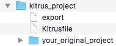

## About

Kitrus is a community extendable tool for storing sets of files in one location and utilising transformed copies of them in another. It was originally developed to facilitate Minecraft: Java Edition data pack development, but can be used for anything at all.

I built the first version of Kitrus slowly over the course of 9 months, only adding features as I needed them. The result is a program that is not only highly practical but has proven its usefulness and is easily extendible for future functionality.

As of 9 months in development, Kitrus has saved my project 858 files and 2950 lines of code whilst also allowing me to develop in a more convenient location and removing all duplicate object strings.

## Features

Running Kitrus will copy files from a set of predefined locations to a set of predefined destinations. In the process, it will apply transformations to those files and report the results of those transformations. Transformations can be made by anyone. At present, Kitrus has a mere two transformations:

### Strings

Strings were the original purpose of Kitrus; To allow constant string definitions in data packs. Thus, the strings transformation allows you to associate string keys with string values in a collection of .str files. These string keys can then be referenced anywhere in the files being transformed. When the files are exported by Kitrus, the string keys will be replaced with their associated values. This allows you to write something once, and use it in multiple locations without having to worry about what those files will be used for.

For example, Minecraft does not support strings, so referencing the name of an item in multiple places (Say, in a loot table and in a command) requires you to write it out twice. If you want to change it any point, you would have to change it in multiple places. This is an issue that mature programming languages solved eons ago, but fledgling languages like Minecraft commands and other systems that have more rigid requirements have not solved the issue. In these cases, Kitrus' strings transformations can save huge amounts of time and effort.

Strings don't just stop at constant string definitions though. They also allow you to use strings keys inside string defintions, define templates for string substitution and create classes of directories, files and lines of code that will be instantiated with predefined objects during the transformation.

### Stats

The stats transformation does not change the files in any way. It simply reports what file types there are and how many of each type there are.

## Quick Start Guide

If you already have a project and want to quickly start using it with Kitrus and worry about the details later, follow these steps:

1. Create a directory in an easy to access location (Like your Desktop or Documents) in which to store your original project. We will call this directory your Kitrus project directory.
2. Copy your original project folder into the directory (So your original project folder should be contained within your Kitrus project directory).
3. **BACK UP THE FILES NEAR YOUR ORIGINAL PROJECT!** Kitrus works by overwriting the target location. If you mistype the target location, other things may be **PERMANENTLY DELETED**.
4. If you don't already have it, install Python 3. You can get 3.7.0 here: https://www.python.org/downloads/release/python-370/
5. Download Kitrus. Move it to a location on your computer where you want to store it permanently. We will call this location your Kitrus install directory.
6.

#### Windows

Open the script named "export.bat" with a basic text editor (e.g. Wordpad). The file will look like this:
```
@ECHO OFF

SET KITRUSINSTALLDIRECTORY=
SET KITRUSPROJECTDIRECTORY=%~dp0
CD %KITRUSINSTALLDIRECTORY%

root_export "%KITRUSINSTALLDIRECTORY%" "%KITRUSPROJECTDIRECTORY%"
```
Write the absolute path of your Kitrus install directory at the end of the line `SET KITRUSINSTALLDIRECTORY=` without a trailing backslash. The result should look something like this:
```
SET KITRUSINSTALLDIRECTORY=C:\Users\AvantirChaosfire\Documents\kitrus
```
Assuming that `C:\Users\AvantirChaosfire\Documents\kitrus\export.sh` is the file you're editting.

#### Mac/Linux

Open the script named "export.sh" with a basic text editor (e.g. TextEdit or gedit). The file will look like this:
```
#!/bin/sh

export KitrusInstallDirectory=
export KitrusProjectDirectory="$( cd "$( dirname "${BASH_SOURCE[0]}" )" >/dev/null && pwd )"
cd "$KitrusInstallDirectory"

./root_export.sh
```
Write the absolute path of your Kitrus install directory at the end of the line `export KitrusInstallDirectory=` without a trailing slash. The result should look something like this:
```
export KitrusInstallDirectory=/Users/Avantir-Chaosfire/Documents/kitrus
```
Assuming that `/Users/Avantir-Chaosfire/Documents/kitrus/export.sh` is the file you're editting.

7. Copy the script you just editted into your Kitrus project directory.
8. Create a file in your Kitrus project directory with no extension named `Kitrusfile`. Open it with your basic text editor and paste in the following:

```
#modules
<source> : generic : <destination> : strings,stats
```

8. Replace `<source>` with the name of the folder your original project is contained in inside of your Kitrus project directory, and replace `<destination>` with the full path to the directory you copied into your Kitrus project folder in step 2 (i.e. the directory you want all of your project files to end up in). The directory you enter here **WILL BE DELETED**. So make sure it's the right directory and that there's nothing else in or near there you haven't backed up.

9. All done! (TODO: Example figure) You can now run the export script in your Kitrus project directory to export and transform the contents of your projects folder into the destination. The following steps will explain basic usage of strings.
10. Create a folder called "strings" inside of your Kitrus project directory.
11. You can create files to define strings inside of your strings directory that have the extension ".str".
12. Every line of a .str file is either blank or contains a string key-value pair. The first word of a line is the string key, and everything after that is the string value.
13. You can reference strings inside of any files in your project. To reference a key, just write `##key##`. After exporting, the result at the destination will look like `value`. For example, with the strings:
```
Greeting How are you doing?
Surprised Oh no
```
And the following written in a file called "conversation.txt"
```
One day, Bob said to Joe "Hey Joe! ##Greeting##".
##Surprised##, Joe thought as he turned around.
```
Becomes the a file called "conversation.txt" at the destination defined in your Kitrusfile, with the contents
```
One day, Bob said to Joe "Hey Joe! How are you doing?".
Oh no, Joe thought as he turned around.
```
You can reference strings in any kind of file, including mcfunction and json files.

## Usage in Data Pack Development

Examples of things I've used Kitrus for to make data pack development easier:

1. Store the ids and data tags of all custom items as strings, allowing them to be used or checked in any function and module. Every item is in both a loot table and a give function, allowing me to easily test with items and set them as loot.
2. Store all custom entities (Enemies, bosses, NPCs, marker armor stands, etc.) as strings, allowing them to be summoned from any function and module.
3. Store significant coordinates as strings. If ever I want to change the location of something that matters to functions, one change in the strings changes all of the functions too.
4. Store item name objects, attribute modifiers, villager tags and common entity tags (Among other things) as strings, so that they can be used in multiple places to dramatically reduce the amount of typing I have to do and the complexity of the commands I read.
5. Removed nearly duplicate commands in give functions, custom item, enemy, spellcasting, weapon and enemy ai systems by putting them in classes. This is where all those files and commands I saved come from.

## Full Installation, Usage Instructions and Documentation on Developing Transformations

TODO

## Contributing

TODO

## License

MIT License

Copyright (c) [year] [fullname]

Permission is hereby granted, free of charge, to any person obtaining a copy
of this software and associated documentation files (the "Software"), to deal
in the Software without restriction, including without limitation the rights
to use, copy, modify, merge, publish, distribute, sublicense, and/or sell
copies of the Software, and to permit persons to whom the Software is
furnished to do so, subject to the following conditions:

The above copyright notice and this permission notice shall be included in all
copies or substantial portions of the Software.

THE SOFTWARE IS PROVIDED "AS IS", WITHOUT WARRANTY OF ANY KIND, EXPRESS OR
IMPLIED, INCLUDING BUT NOT LIMITED TO THE WARRANTIES OF MERCHANTABILITY,
FITNESS FOR A PARTICULAR PURPOSE AND NONINFRINGEMENT. IN NO EVENT SHALL THE
AUTHORS OR COPYRIGHT HOLDERS BE LIABLE FOR ANY CLAIM, DAMAGES OR OTHER
LIABILITY, WHETHER IN AN ACTION OF CONTRACT, TORT OR OTHERWISE, ARISING FROM,
OUT OF OR IN CONNECTION WITH THE SOFTWARE OR THE USE OR OTHER DEALINGS IN THE
SOFTWARE.